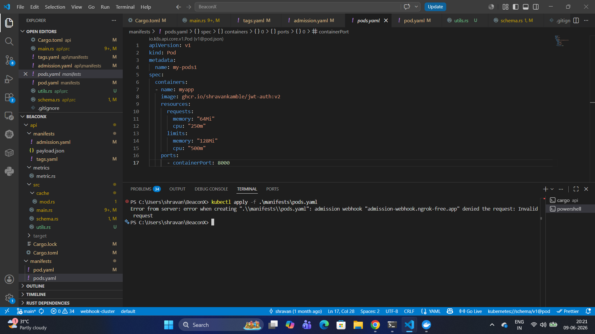

# ImageGuard

**Kubernetes-Native Image Vulnerability Policy Engine**

ImageGuard enforces configurable vulnerability thresholds on container images **before** they are admitted into Kubernetes clusters. It solves the common "all-or-nothing" problem in container security by allowing teams to define acceptable risk levels per severity.

### How It Works (End-to-End Flow)

1. **CI Stage** — The composite GitHub Action scans the image with Trivy and generates a vulnerability report.
2. **GitOps Stage** — The report is saved as an `ImageVulnerabilityReport` Custom Resource and synced into the cluster via ArgoCD.
3. **Controller Stage** — The Rust controller evaluates the report against `ImageThreshold` policies using label selectors and updates the status to `allowed` or `denied`.
4. **Webhook Stage** — The validating admission webhook performs a fast cache lookup and denies workloads containing violating images.

### Completed Features
- Custom Rust controller using `kube-rs` and `tokio` for policy evaluation with CRDs and label selectors.
- Rust + Axum validating admission webhook with in-memory cache (`moka` with TTL/TTI) and background watcher.
- GitOps integration with ArgoCD and Trivy scanning.
- Policy evaluation using Kubernetes CRDs and label selectors.
- Prometheus metrics (allowed/denied counters) exposed on the `/metrics` endpoint via middleware.
- Webhook tested with ngrok for real admission control validation.

### Work in Progress
- composite GitHub Action (`imageguard-scan`) for seamless CI integration. [action](https://github.com/Shravankamble/imageguard-scan.git)
- Helm chart for easy deployment of controller and webhook
- Cert-manager integration for securing the webhook with TLS
- Multi-cloud testing on AWS EKS and GCP GKE

### Architecture Highlights
ImageGuard follows an **opt-in model** — only images processed through the CI integration are evaluated. This gives development and platform teams full control over which workloads receive strict security enforcement.

The controller and webhook are intentionally decoupled for better scalability, isolation, and high availability.

### Observability
ImageGuard includes built-in observability to monitor admission control and policy enforcement.

**Prometheus Metrics**
- Exposed on the `/metrics` endpoint via Axum middleware.
- Key metrics include `imageguard_admission_requests_total` with labels for `response` ("allowed"/"denied") and `method`.

**Grafana Integration**
- Metrics can be easily visualized in Grafana.
- Pre-configured dashboards are planned for future releases.

### Testing
- **Webhook Testing with ngrok - Admission Control Validation**
- 
- *Successfully tested the validating admission webhook using ngrok for real Kubernetes admission requests.*

### Technologies Used
- Rust (`kube-rs`, `tokio`, `axum`, `moka`)
- Python (report parser)
- Kubernetes (Controllers, Admission Webhooks, CRDs)
- GitOps (ArgoCD)
- Trivy, Prometheus + Grafana
